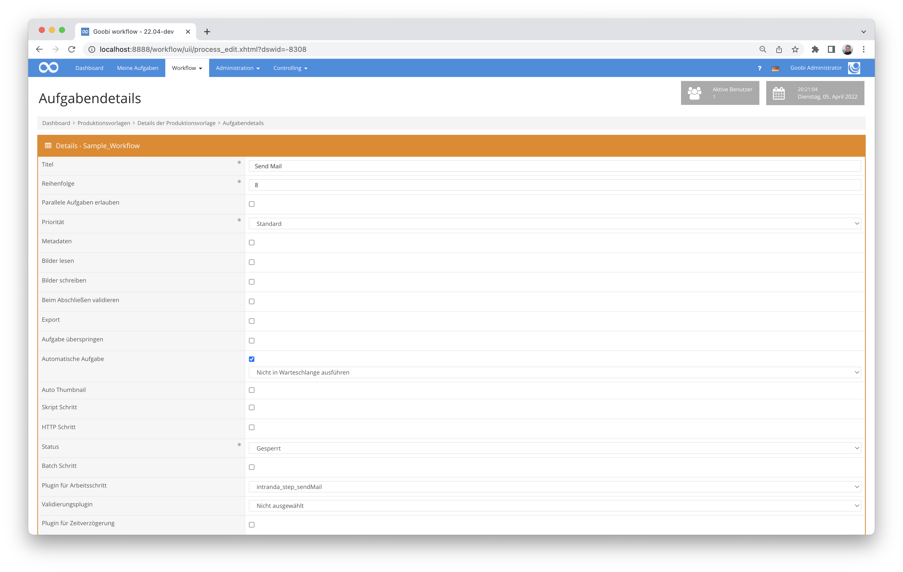

## Einführung
Die vorliegende Dokumentation beschreibt die Installation, die Konfiguration und den Einsatz des Step Plugins für versenden von Mails innerhalb einer Aufgabe in Goobi workflow. Die Liste der Empfänger und der Text lassen sich für verschiedene Arbeitsschritte individuell konfigurieren. Dabei stehen auch alle Felder aus dem VariablenReplacer zur Verfügung. Somit kann auch auf Metadaten oder Informationen zum Vorgang, Schritt oder Projekt zurückgegriffen werden.


## Installation
Das Plugin besteht insgesamt aus den folgenden zu installierenden Dateien:

```bash
plugin_intranda_step_sendMail-base.jar
plugin_intranda_step_sendMail.xml
```

Die erste Datei muss in dem folgenden Verzeichnis installiert werden:

```bash
/opt/digiverso/goobi/plugins/step/plugin-intranda-step-sendMail-base.jar
```

Daneben gibt es eine Konfigurationsdatei, die an folgender Stelle liegen muss:

```bash
/opt/digiverso/goobi/plugins/config/plugin_intranda_step_sendMail.xml
```


## Überblick und Funktionsweise
Das Plugin wird üblicherweise vollautomatisch innerhalb des Workflows ausgeführt. Es ermittelt zunächst, ob sich innerhalb der Konfigurationsdatei ein Block befindet, der für den aktuellen Workflow bzgl. des Projektnamens und Arbeitsschrittes konfiguriert wurde. Wenn dies der Fall ist, wird die Mail generiert und an die konfigurierten Empfänger versendet.

Dieses Plugin wird in den Workflow so integriert, dass es automatisch ausgeführt wird. Eine manuelle Interaktion mit dem Plugin ist nicht notwendig. Zur Verwendung innerhalb eines Arbeitsschrittes des Workflows sollte es wie im nachfolgenden Screenshot konfiguriert werden.



## Konfiguration
Die Konfiguration des Plugins erfolgt in der Datei `plugin_intranda_step_sendMail.xml` wie hier aufgezeigt:

{{CONFIG_CONTENT}}

{{CONFIG_DESCRIPTION_PROJECT_STEP}}

| Parameter | Erläuterung |
| :--- | :--- |
| `project` | Dieser Parameter legt fest, für welches Projekt der aktuelle Block `<config>` gelten soll. Verwendet wird hierbei der Name des Projektes. Dieser Parameter kann mehrfach pro `<config>` Block vorkommen. |
| `step` | Dieser Parameter steuert, für welche Arbeitsschritte der Block `<config>` gelten soll. Verwendet wird hier der Name des Arbeitsschritts. Dieser Parameter kann mehrfach pro `<config>` Block vorkommen. |
| `<receiver>` | Das Feld `<receiver>` kann mehrfach genutzt werden und enthält die E-Mail-Adressen der Empfänger. Eine Verwendung von Variablen ist hier möglich. |
| `<messageSubject>` | Dieser Parameter erlaubt die Festlegung des Subjects. Eine Verwendung von Variablen ist hier möglich. |
| `<messageBody>` | In `<messageBody>` wird die Mail selbst definiert. Hier kann PlainText oder auch ein HTML formatierter Text geschrieben werden. Zusätzlich ist hier der Zugriff auf das Variablensystem von Goobi möglich, damit können auch Informationen zum Vorgang, Projekt, Eigenschaften oder Metadaten in der Mail genutzt werden. |

**Achtung:** Das Plugin erwartet, dass die Mail-Konfiguration innerhalb der globalen Goobi-Konfigurationsdatei `goobi_mail.xml` korrekt konfiguriert ist. Andernfalls erfolgt kein Mailversand. 
