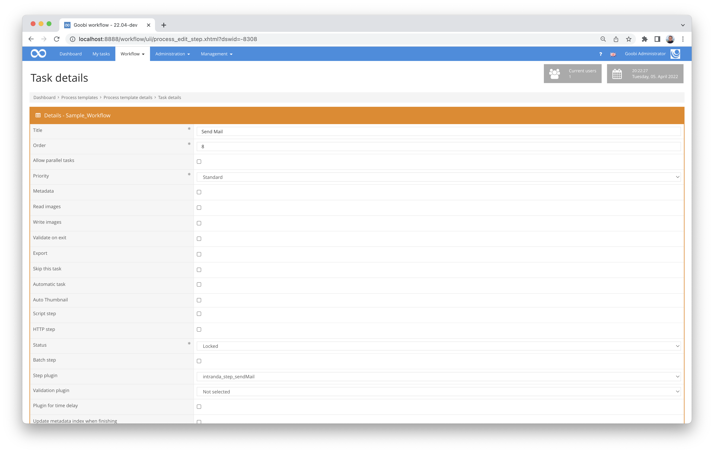

## Introduction
This documentation describes the installation, configuration and use of the Step Plugin for sending emails within a task in Goobi workflow. The list of recipients and the text can be configured individually for different steps. All fields from the VariableReplacer are also available. This means that metadata or information on the task, step or project can also be accessed.


## Installation
The plugin consists in total of the following files to be installed:

```bash
plugin-intranda-step-sendMail-base.jar
plugin_intranda_step_sendMail.xml
```

The first file must be installed in the following directory:

```bash
/opt/digiverso/goobi/plugins/step/plugin-intranda-step-sendMail-base.jar
```

In addition, there is a configuration file that must be located in the following place:

```bash
/opt/digiverso/goobi/plugins/config/plugin_intranda_step_sendMail.xml
```


## Overview and functionality
The plugin is usually executed fully automatically within the workflow. It first determines whether there is a block in the configuration file that has been configured for the current workflow with regard to the project name and work step. If this is the case, the mail is generated and sent to the configured recipients.

This plugin is integrated into the workflow in such a way that it is executed automatically. Manual interaction with the plugin is not necessary. For use within a workflow step, it should be configured as shown in the screenshot below.




## Configuration
The plugin is configured in the file `plugin_intranda_step_sendMail.xml` as shown here:

{{CONFIG_CONTENT}}

{{CONFIG_DESCRIPTION_PROJECT_STEP}}

| Parameter | Explanation |
| :--- | :--- |
| `project` | This parameter determines for which project the current block `<config>` should apply. The name of the project is used here. This parameter can occur several times per `<config>` block. |
| `step` | This parameter controls for which workflow steps the block `<config>` should apply. The name of the workflow step is used here. This parameter can occur several times per `<config>` block. |
| `<smtpServer>` | This parameter sets the SMTP server. |
| `<smtpUseStartTls>` | This parameter controls whether the access should run like TLS. |
| `<smtpUseSsl>` | This sets whether communication should be encrypted via SSL. |
| `<smtpUser>` | Dieser Parameter legt den Nutzernamen fest. |
| `<smtpPassword>` | This defines the password to be used. |
| `<smtpSenderAddress>` | The field `<smtpSenderAddress>` defines the displayed sender, which can also be different from the user name. |
| `<receiver>` | The field `<receiver>` can be used multiple times and contains the email addresses of the recipients. |
| `<messageSubject>` | This parameter allows the subject to be defined. The use of variables is possible here. |
| `<messageBody>` | In `<messageBody>` the mail itself is defined. Plain text or HTML formatted text can be written here. In addition, access to the Goobi variable system is possible here, so that information on the task, project, properties or metadata can also be used in the mail. |
